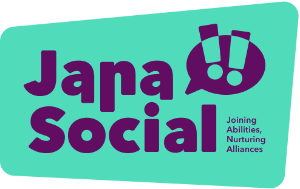
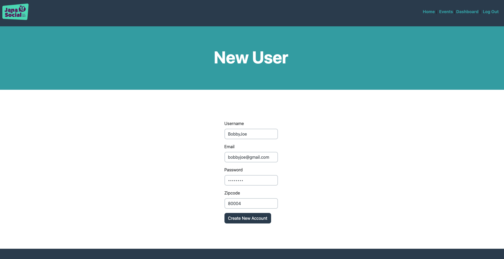
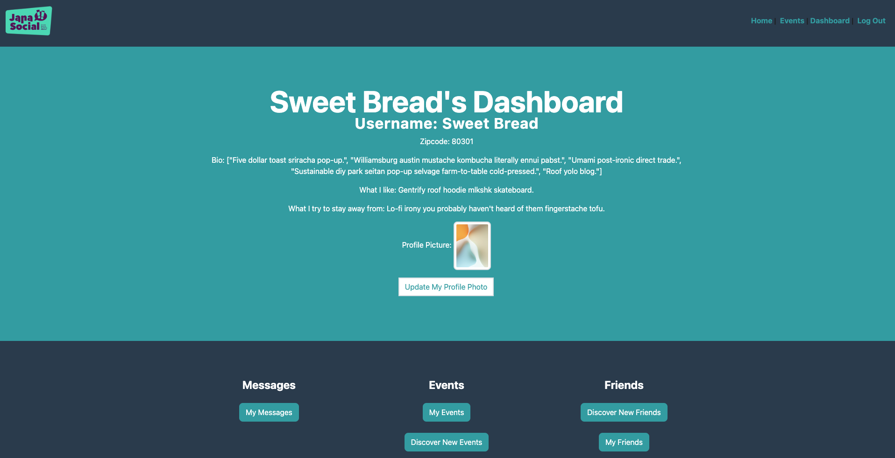
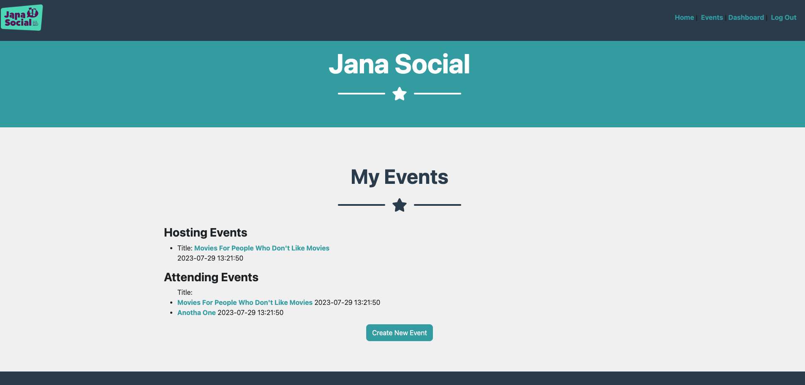
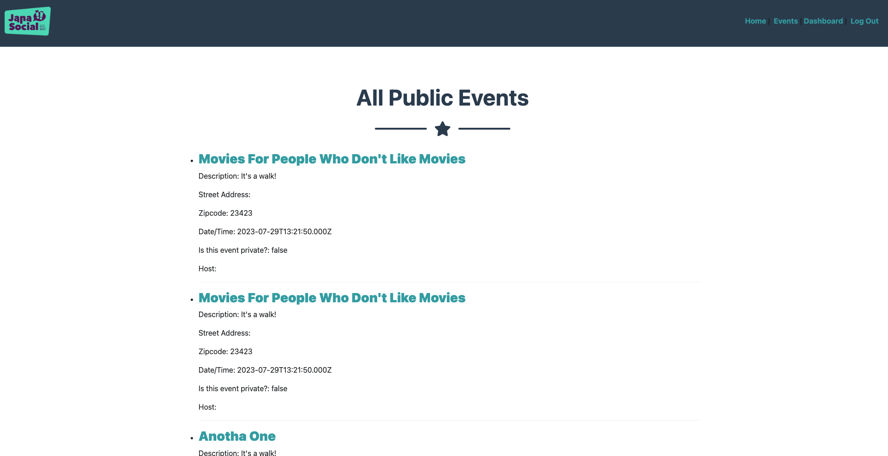
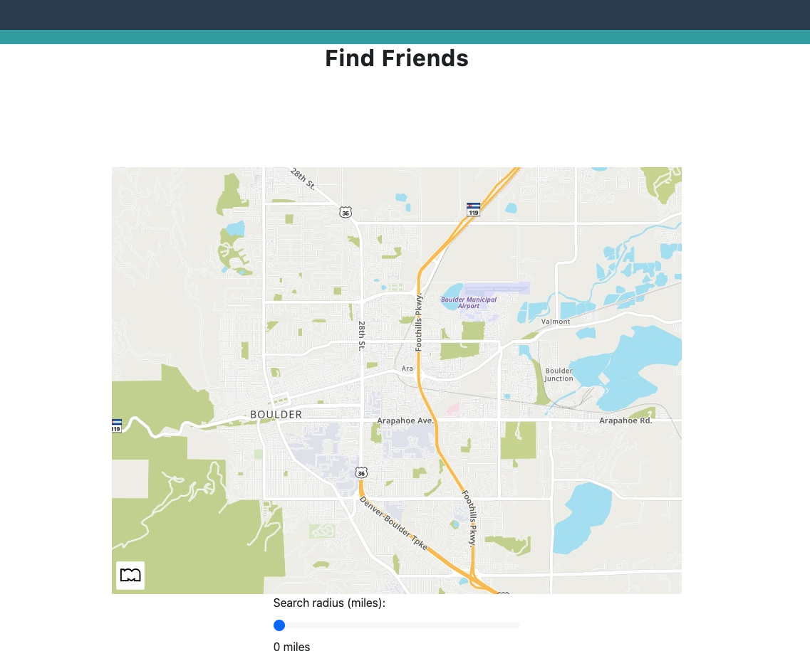
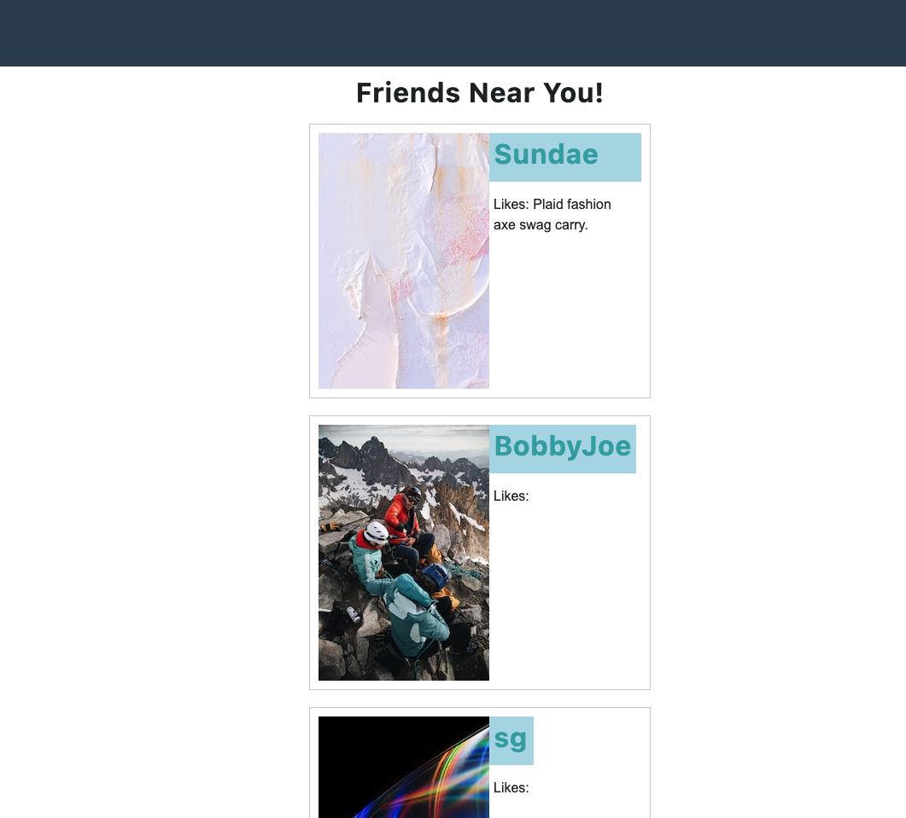
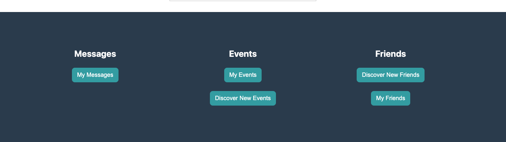

<h1> Jana Social </h1>



[Render Deployment](https://jana-social-fe.onrender.com) <br>
[Back End Repository](https://github.com/jana-social/jana_social) <br>
[DB Schema](https://erd.dbdesigner.net/designer/schema/1690390259-jana_social) <br>
[Full Team Miro Board](https://miro.com/app/board/uXjVMz_g040=/) |
[Users Team Miro Board](https://miro.com/app/board/uXjVMz5BkDM=/) |
[Events Team Miro Board](https://miro.com/app/board/uXjVMz4nZmc=/)

<hr>


<h2> Teams </h2>

<h3> Users Team </h3>

 - Lauren Golden: [GitHub](https://github.com/goldenll) | [LinkedIn](https://www.linkedin.com/in/goldenll/)
 - Alex Kiselich: [GitHub](https://github.com/AlexKiselich) | [LinkedIn](https://www.linkedin.com/in/alexanderkiselich/)
 - Garrett Gregor: [GitHub](https://github.com/garrettgregor) | [LinkedIn](https://www.linkedin.com/in/garrett-gregor/)
 - Andy Weissman: [GitHub](https://github.com/andyweissman6) | [LinkedIn](https://www.linkedin.com/in/andy-weissman/)

<h3> Events Team </h3>

 - Jeff Nelson: [GitHub](https://github.com/jpnelson85) | [LinkedIn](https://www.linkedin.com/in/jeff-nelson-307aba45/)
 - Sarah Garlock: [GitHub](https://github.com/sarahgarlock) | [LinkedIn](https://www.linkedin.com/in/sarah-garlock/)
 - Jesse Thomas: [GitHub](https://github.com/jgthomas-12) | [LinkedIn](https://www.linkedin.com/in/jesse-g-thomas/)
 - Austin Woods: [GitHub](https://github.com/boomclear) | [LinkedIn](https://www.linkedin.com/in/austin-woods-1830aa195/)

<h3> Location/Friends Team </h3>

 - Myles Nottingham: [GitHub](https://github.com/MylesNottingham) | [LinkedIn](https://www.linkedin.com/in/mylesnottingham/)
 - Blaine Glasgow: [GitHub](https://github.com/GlowMunch) | [LinkedIn](https://www.linkedin.com/in/blaine-glasgow-134a9017a/)
 - Amy Spears: [GitHub](https://github.com/Amspears007) | [LinkedIn](https://www.linkedin.com/in/amy-marie-spears-900997105/)
 - Steven Stackhouse: [GitHub](https://github.com/stackmm) | [LinkedIn](https://www.linkedin.com/in/steven-stackhouse/)

<hr>

<h2>What is Jana Social?</h2>

Jana Social is an application for caregivers of adults with disabilities. It is a place for caregivers to connect with other caregivers, share stories, and find events in their area. Jana Social is a place for caregivers to find support and community. Users can create/join events, search for other users, and add friends. 

This project was created for the Turing School of Software and Design's Mod 3 Group Project. The project was built over the course of 12 days. We had three teams working on the project: Users, Events, and Location/Friends. Each team was split up between back end and front end. The back end teams were responsible for building out the API endpoints and the front end teams were responsible for building out the user interface.
<hr>

<h2>Getting Started</h2>

<h3>Versions</h3>

Ruby 3.2.2

Rails 7.0.6

<br>
<h3>Installation</h3>

Mapquest API Keys:[here](https://developer.mapquest.com/)

<br>
Clone this repository:

Add Figaro to your Gemfile and bundle install:

```ruby
gem 'figaro'
```
`bundle install`

Or install Figaro the easy way:

```ruby
$ bundle exec figaro install
```

This creates a commented `config/application.yml` file and adds it to your `.gitignore`. Add your own configuration to this file and you're done!

<h3>For local testing -</h3>

- Clone Jana Social's [Back End Repository](https://github.com/jana-social/jana_social):

- In the app/services/render_service.rb file, comment out the url to `Faraday.new(url: "https://jana-social-be.onrender.com")` and comment in `Faraday.new(url: "http://localhost:3000")`. *This is important for local testing.*

- Run Back End Repo in server with localhost:3000

- Run Front End Repo in servier with localhost:5000

- Run `$ bundle exec rspec` to run the test suite.

<hr>

<h2>Screen Shots</h2>

<h3>Home Page</h3>


<h3>New User Sign Up</h3>




<h3>User Dashboard</h3>




<h3>My Events</h3>




<h3>All Events</h3>




<h3>Find Friends</h3>




<h3>Search Friends</h3>




<h3>Footer</h3>



